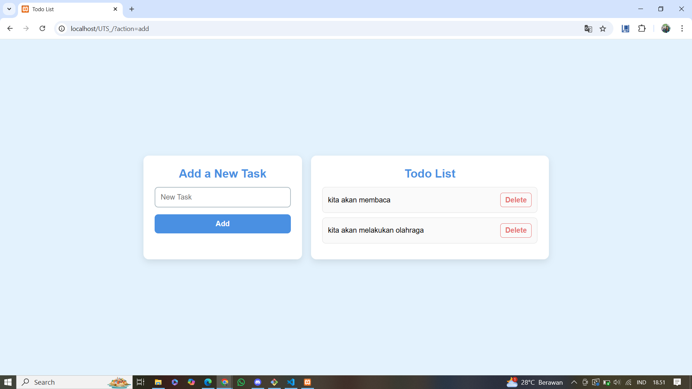
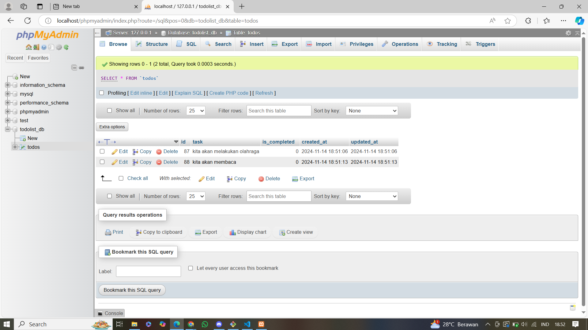

Todo List dengan Tanggal Pembuatan
Proyek Todo List ini adalah aplikasi web sederhana untuk mencatat, menampilkan, dan mengelola daftar tugas atau kegiatan (todo). Setiap tugas yang ditambahkan akan otomatis menyimpan tanggal pembuatan dan menampilkannya di samping teks tugas.

Fitur
Menambah Tugas Baru: Setiap tugas baru disertai dengan tanggal dan waktu saat tugas tersebut ditambahkan.
Menampilkan Daftar Tugas: Menampilkan semua tugas yang sudah disimpan, termasuk tanggal pembuatan.
Menghapus Tugas: Fitur untuk menghapus tugas tertentu dari daftar.
Navigasi Sederhana: Navbar untuk kemudahan navigasi ke berbagai bagian halaman.
Teknologi yang Digunakan
HTML & CSS: Untuk struktur dan desain halaman.
PHP: Untuk penanganan server-side, penyimpanan dan pengelolaan data.
JavaScript: Untuk interaksi dan fungsi tambahan (jika diperlukan).
File System (todos.txt): File teks sederhana untuk menyimpan daftar tugas dan tanggal.
Struktur Folder
.
├── core/
│   └── Database.php        # File untuk mengatur koneksi ke database
├── controllers/
│   └── TodoController.php  # Logika pengaturan tugas (add, delete, complete)
├── models/
│   └── TodoModel.php       # Model tugas untuk mengelola data dari database
     Todo.php
├── views/
│   └── listTodos.php       # Tampilan utama dari aplikasi
├── assets/
    screenshot
        Database.png         #tampilan database
        Screenshot.png       #tampilan todolist
│   ├── css/
│   │   └── style.css       # File CSS untuk mengatur tampilan
│   └── js/
│       └── script.js       # File JavaScript untuk mengatur interaksi halaman
└── README.md               # Dokumentasi proyek

1. Menambah Tugas Baru
Pengguna memasukkan teks tugas pada form di halaman utama.
Saat form dikirim, fungsi PHP addTodoItem dijalankan.
Fungsi ini menyimpan teks tugas beserta tanggal dan waktu saat ini dalam file todos.txt.
Setiap entri disimpan dalam format text | date.
2. Menampilkan Daftar Tugas
Fungsi getTodoItems membaca file todos.txt dan memisahkan teks tugas dan tanggal menggunakan pemisah |.
Setiap tugas dan tanggal ditampilkan di halaman dengan format yang rapi.
3. Menghapus Tugas
Setiap tugas memiliki tombol hapus yang terkait dengan indeks tugas tersebut di file.
Ketika tombol hapus diklik, fungsi deleteTodoItem menghapus tugas berdasarkan indeks yang dipilih, kemudian memperbarui todos.txt.
Instalasi
Clone repository ini atau unduh semua file.
Pastikan server PHP aktif (misalnya menggunakan XAMPP, WAMP, atau server bawaan PHP).
Simpan file dalam direktori server Anda (misalnya, htdocs pada XAMPP).
Buka browser dan akses aplikasi melalui URL seperti http://localhost/UTS_.
Cara Penggunaan
Tambahkan Tugas: Isi tugas baru di form input dan klik tombol "Tambah Todo".
Lihat Daftar Tugas: Setiap tugas yang ditambahkan akan muncul di daftar, lengkap dengan tanggal pembuatannya.
Hapus Tugas: Klik tombol "Hapus" di samping tugas yang ingin dihapus.
Catatan Tambahan
Setiap tugas baru langsung disimpan dalam data base
Format penyimpanan tugas adalah text | date untuk memudahkan pemisahan teks dan tanggal.
Lisensi
Proyek ini bebas digunakan dan dimodifikasi untuk kebutuhan belajar atau pengembangan lebih lanjut.

Dengan README ini, pengguna atau developer lain akan lebih mudah memahami struktur, fitur, dan cara kerja aplikasi Todo List ini.

untuk hasil dokumentasi todolist ini dapat dilihat di

tampilan todo list

tampilan database

