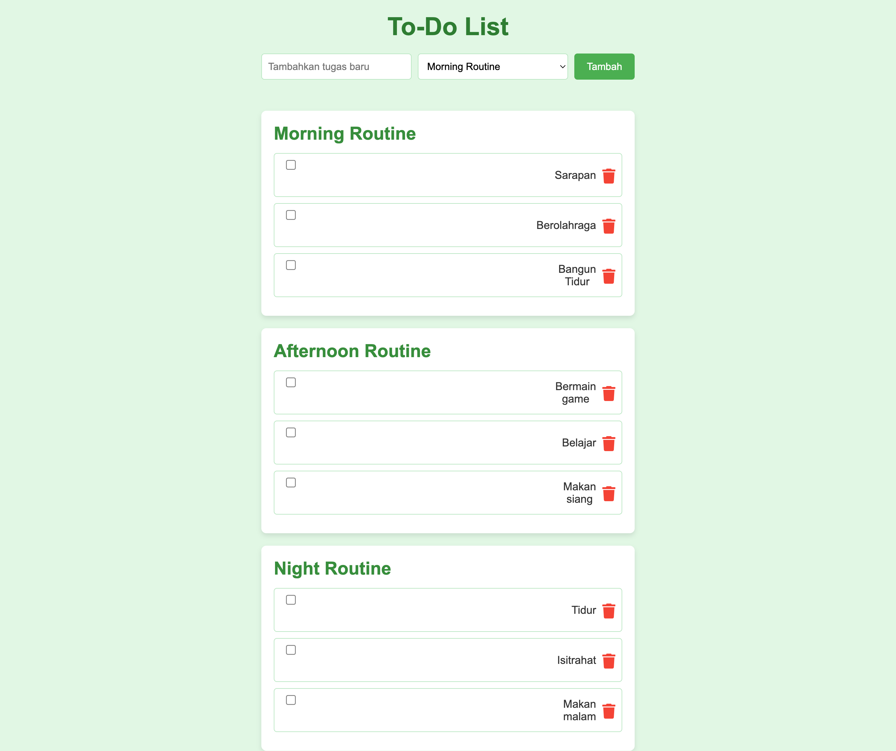

Aplikasi Todo List Daily Routine
=============================

# Todo List Menggunakan OOP dan MVC

## Daftar Isi
1. [Tujuan dari Proyek Todo List](#tujuan-dari-proyek-todo-list)
2. [Struktur Direktori Proyek Todo List](#struktur-direktori-proyek-todo-list)
3. [Penjelasan Struktur](#penjelasan-struktur)
4. [Cara Kerja Fungsionalitas Aplikasi](#cara-kerja-fungsional-aplikasi)
5. [Instalasi](#instalasi)
6. [Cara Penggunaan](#cara-penggunaan)
7. [Teknologi yang Digunakan](#teknologi-yang-digunakan)
8. [Tampilan Aplikasi](#tampilan-aplikasi)

## Tujuan dari Proyek Todo List

1. Menerapkan prinsip _Object-Oriented Programming_ (OOP) dalam PHP.
2. Memahami konsep _Model-View-Controller_ (MVC) dalam pengembangan aplikasi web.
3. Mengintegrasikan template _engine_ untuk pemisahan logika dan tampilan.
4. Membuat aplikasi _Todo List_ sederhana yang dapat melakukan operasi _CRUD (Create, Read, Update, Delete)._

## Struktur Direktori Proyek Todo List

Berikut ini adalah struktur direktori proyek Todo List yang akan kita buat:

```graphql
/todolist_project
├── index.php                    # Entry point aplikasi
├── core
│   └── Database.php             # Koneksi database menggunakan PDO
├── models
│   ├── Todo.php                 # Model Todo yang merepresentasikan setiap task
│   └── TodoModel.php            # Model untuk operasi CRUD pada database
├── controllers
│   └── TodoController.php       # Controller untuk mengatur logika bisnis Todo
├── views
│   └── listTodos.php            # Template/view untuk menampilkan daftar Todo
└── assets
    ├── css
    │   └── style.css            # (Opsional) file CSS untuk styling
    └── js
        └── script.js            # (Opsional) file JavaScript untuk interaksi tambahan
```

## Penjelasan Struktur

- **index.php**: Merupakan entry point aplikasi, mengelola routing permintaan ke controller.
- **core/Database.php**: File yang mengatur koneksi ke database MySQL menggunakan PDO.
- **models/**:
  - **Todo.php**: Class Todo yang merepresentasikan setiap task.
  - **TodoModel.php**: Model untuk melakukan operasi CRUD terhadap database.
- **controllers/TodoController.php**: Controller yang mengatur logika bisnis aplikasi Todo.
- **views/listTodos.php**: Template untuk menampilkan daftar Todo ke pengguna.
- **assets/**:
  - **css/style.css**: (Opsional) Berisi style CSS untuk mempercantik tampilan aplikasi.
  - **js/script.js**: (Opsional) Berisi script JavaScript untuk interaksi tambahan pada tampilan aplikasi. 

Struktur ini membantu menjaga organisasi kode dengan memisahkan logika, tampilan, dan koneksi ke database.

## Cara Kerja Fungsional Aplikasi
Aplikasi Todo List ini dibangun dengan menggunakan prinsip Object-Oriented Programming (OOP) dan Model-View-Controller (MVC). Berikut adalah cara kerja fungsional aplikasi secara keseluruhan:

1. Routing Permintaan Pengguna
- Semua permintaan dari pengguna akan dikirim ke file index.php, yang bertindak sebagai entry point.
- index.php menerima permintaan dan menganalisis parameter action yang ada di URL (misalnya, action=add untuk menambah tugas).

2. Controller
- Berdasarkan aksi yang diminta (add, delete, complete, etc.), aplikasi memanggil controller yang sesuai.
- TodoController.php adalah controller utama yang menangani berbagai aksi terkait Todo.
  - Add Task: Memanggil metode add() untuk menambahkan tugas baru.
  - Delete Task: Memanggil metode delete() untuk menghapus tugas.
  - Complete Task: Memanggil metode markAsCompleted() untuk menandai tugas sebagai selesai.
  - Controller ini bertindak sebagai perantara antara Model dan View.

3. Model
- TodoModel.php bertanggung jawab untuk semua interaksi dengan database. Ini menggunakan metode seperti:
  - create(): Menambahkan tugas baru ke database.
  - delete(): Menghapus tugas dari database.
  - markAsCompleted(): Mengubah status tugas menjadi selesai di database.
  - getAll(): Mengambil semua tugas dari database untuk ditampilkan.
- Todo.php adalah representasi Todo itu sendiri, dengan properti seperti task, category, is_completed, dan sebagainya.

4. View
- listTodos.php adalah file view yang menampilkan daftar tugas di antarmuka pengguna.
- View ini akan menerima data dari controller (daftar tugas) dan menampilkan data tersebut di halaman web.
- Setiap tugas ditampilkan dalam kartu yang dapat dicentang jika sudah selesai, serta memiliki opsi untuk dihapus.

5. Operasi CRUD
- Create: Tugas baru ditambahkan melalui formulir input yang ada di halaman depan. Ketika tugas ditambahkan, data dikirim ke controller, dan kemudian controller berkomunikasi dengan model untuk menyimpan tugas tersebut ke database.
- Read: Tugas yang ada diambil dari database oleh model dan ditampilkan di halaman menggunakan view.
- Update: Ketika tugas ditandai sebagai selesai, statusnya diperbarui di database untuk mencerminkan perubahan tersebut.
- Delete: Ketika tugas dihapus, data tugas dihapus dari database.

6. Interaksi Pengguna
- Pengguna dapat menambahkan tugas baru, menandai tugas sebagai selesai, dan menghapus tugas yang sudah tidak dibutuhkan.
- Aplikasi menggunakan checkbox untuk menandai tugas sebagai selesai. Teks tugas akan dicoret saat dicentang.
- Ikon sampah digunakan untuk menghapus tugas.


## Instalasi

1. **Clone Repositori**:
   ```bash
   git clone https://github.com/username/todolist.git
   cd todolist

2. **Mengatur Database**:

- Buat database dengan nama todolist_db.
- Import skrip SQL berikut untuk membuat tabel todos:

```sql
CREATE DATABASE todolist_db;

USE todolist_db;

CREATE TABLE todos (
    id INT AUTO_INCREMENT PRIMARY KEY,
    task VARCHAR(255) NOT NULL,
    category VARCHAR(50) NOT NULL,
    is_completed BOOLEAN DEFAULT 0,
    created_at TIMESTAMP DEFAULT CURRENT_TIMESTAMP,
    updated_at TIMESTAMP DEFAULT CURRENT_TIMESTAMP ON UPDATE CURRENT_TIMESTAMP
);
```

3. Mengonfigurasi Koneksi Database:

- Sesuaikan pengaturan koneksi database di file database.php jika perlu.

4. Jalankan Aplikasi:

- Jika Anda menggunakan server lokal seperti XAMPP atau MAMP, letakkan aplikasi ini di dalam folder htdocs atau www, kemudian akses aplikasi melalui http://localhost/todolist_project.


## Cara Penggunaan

1. Menambahkan Tugas:
- Masukkan nama tugas di kolom input, pilih kategori tugas, dan klik tombol "Tambah".

2. Menandai Tugas sebagai Selesai:
- Klik checkbox di sebelah tugas yang ingin Anda tandai sebagai selesai. Teks tugas tersebut akan dicoret.

3. Menghapus Tugas:
- Klik ikon sampah di sebelah tugas yang ingin Anda hapus.

4. Mengelompokkan Tugas:
- Tugas dapat dikelompokkan ke dalam tiga kategori: Morning Routine, Afternoon Routine, dan Night Routine.

## Teknologi yang digunakan
- PHP: Untuk logika aplikasi dan komunikasi dengan database.
- MySQL: Sebagai sistem manajemen basis data untuk menyimpan tugas-tugas.
- CSS: Untuk styling aplikasi.
- Font Awesome: Untuk ikon sampah yang digunakan dalam aplikasi.

## Tampilan Aplikasi



